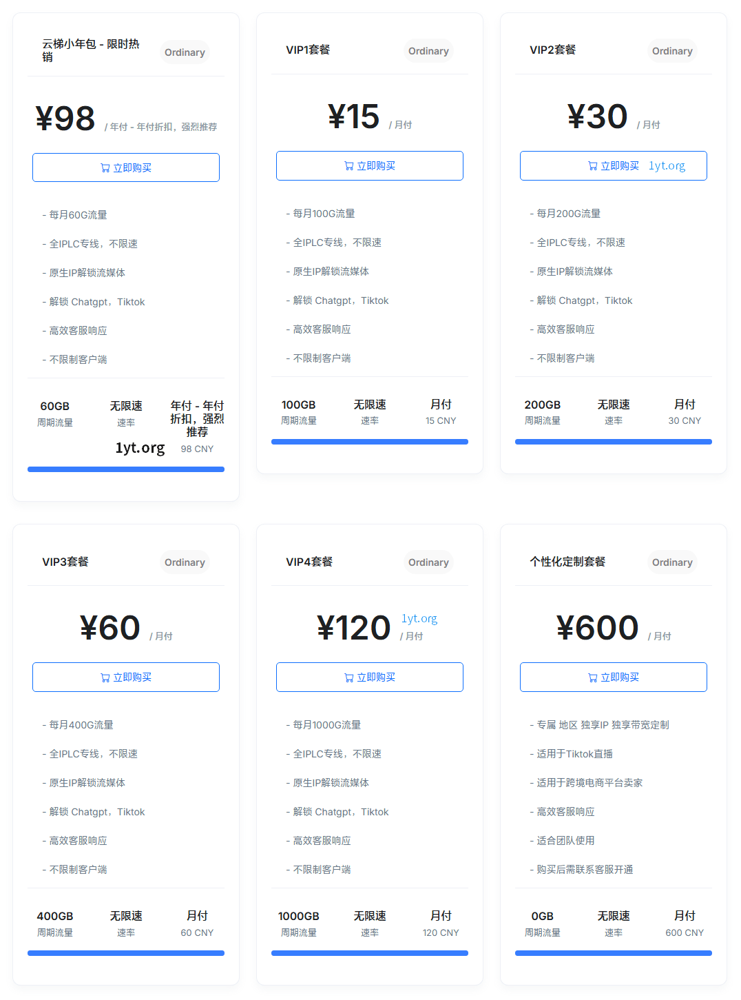

# 1云梯官网地址

永久官网：[1yunti.com](https://i02.1ytaff.com/register?aff=K1BRG55W)

## 1云梯介绍

某大佬新开的加速器，IPLC全专线和Trojan协议，节点多，无倍率，不限制设备数，目前用下来的稳定性还不错。

### 1云梯特点

>IPLC全专线节点，原生IP，最高速率可达 2000Mbps。
>
>80+节点，覆盖香港、台湾、日本、美国、新加坡、英国、韩国等，还有越南、阿根廷、土耳其、马来西亚、菲律宾、印度等小众需求的国家地区。
>
>全节点支持流媒体解锁（包括Netflix , Disney+, HBO等）。
>
>完美解锁ChatGPT，支持Tiktok本土短视频运营和直播。
>
>晚高峰不限速，所有套餐x1倍率。
>
>可支持企业和个人独享IP和家宽定制，线路稳定风险小。

## 1云梯优惠码

月/季/半年/年付 8折，（叠加优惠高达6.4折）优惠码：[chunjie20%](https://xuv.cc/out/1yunti)  可重复使用5次

两年/三年付 75折（叠加优惠高达4.5折 ）优惠码：[chunjie25%](https://xuv.cc/out/1yunti)  可重复使用5次

注意：云梯小年包 – 套餐 不可使用优惠码 其他正常使用

## 1云梯套餐价格

一云梯vpn套餐价格入门款￥15/100GB/月，年付优惠力度更大。

| 套餐      | 月流量    | 月付   | 季付    | 半年付  | 年付    | 两年付   | 三年付   |
|---------|--------|------|-------|------|-------|-------|-------|
| 云梯小年包   | 60GB   | ￥8.2 | ￥24.6 | ￥49  | ￥98   | ￥168  | ￥258  |
| VIP1    | 100GB  | ￥15  | ￥41   | ￥77  | ￥144  | ￥252  | ￥324  |
| VIP2    | 200GB  | ￥30  | ￥81   | ￥153 | ￥288  | ￥504  | ￥648  |
| VIP3    | 400GB  | ￥60  | ￥171  | ￥324 | ￥576  | ￥1008 | ￥1296 |
| VIP4    | 1000GB | ￥120 | ￥324  | ￥697 | ￥1152 | ￥2016 | ￥2592 |
| DIY定制套餐 |        | ￥600 |       |      |       |       |       |

热门套餐推荐：[云梯小年包](https://xuv.cc/out/1yunti)（￥98/年，每月60G流量）

## 一云梯好用吗？

目前试用没有什么问题，速度、稳定性都不错，全节点解锁了ChatGPT。

**温馨提示：任何服务均有跑路风险，请自行注意防范！**

**本页面仅分享网络信息，不做推荐，有问题请自行联系服务商处理！**
